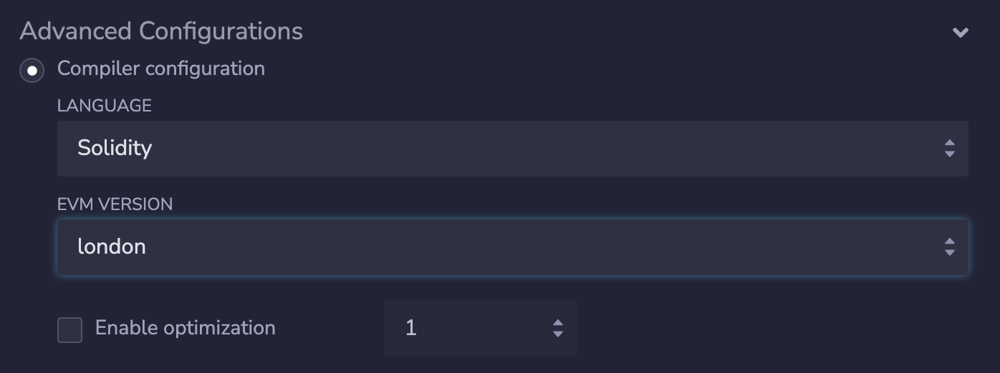
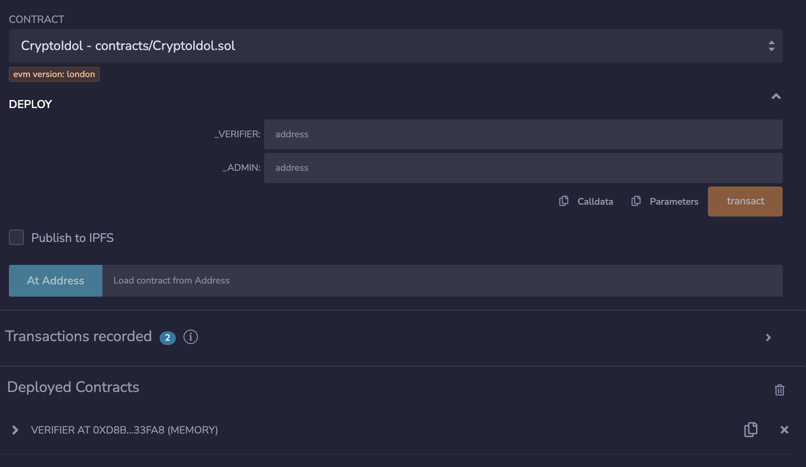

# Idol Contracts Tutorial


This is part 4 of our tutorial on building the [Cryptoidol](https://cryptoidol.tech) demo app; check out the [backend](https://github.com/zkonduit/cryptoidol) and [frontend](https://github.com/zkonduit/cryptoidol-frontend).

The crypto idol contract stores the score of contestants and makes calls to the on-chain evm verifier of the corresponding ai model used to judge contestants to validate the submitted scores. 

## Step 1. Write CryptoIdol.sol

- **Verifier Contract Interface:** The contract leverages an external Verifier contract to verify the proof submitted by contestants. The Verifier contract interface has one function - **`verify`** - which takes public inputs and a proof as parameters and returns a boolean indicating whether the proof is valid.

```solidity
// SPDX-License-Identifier: MIT
pragma solidity ^0.8.17;

interface Verifier {
    function verify(
        uint256[2] calldata pubInputs,
        bytes calldata proof
    ) external view returns(bool);
}
```

- **Contestant Struct:** The Contestant struct keeps track of a participant's score and the cycle in which they participated. A mapping associates an address (the contestant's Ethereum address) with another mapping of uint256 (the contestants entry number) to Contestant. The number of entries a given contestant has done is store in the contestantsCount mapping.

```solidity
contract CryptoIdol {

    struct Contestant {
        uint256 score;
        uint256 cycle;
    }
mapping(address => uint256) public contestantsCount;
mapping(address => mapping(uint256 => Contestant)) public contestants;
```

- **Admin:** The contract has an admin address, responsible for updating the Verifier contract when a new cycle occurs. Only the admin can perform this operation. We set the admin account to the EZKL team’s multisig wallet.
- **Cycle:** This represents the current cycle of the competition. The cycle number is incremented whenever the admin updates the Verifier contract.

```solidity
// The admin address in charge of updating the to new verifier
// each new cycle.
address public immutable admin;

// The cycle number. This will be incremented by the admin each 
// time a new cycle occurs.
uint16 public cycle = 1;
```

**3. Events**

- **NewEntry:** This event is emitted when a contestant submits their score. It logs the contestant's address, the count of their submissions, their score, and the cycle number. These events are indexed on the client-side to construct the leaderboard.
- **NewCycle:** This event is emitted when the admin updates the Verifier contract, signalling the start of a new cycle. It logs the new Verifier's address and the updated cycle number.

```solidity
event NewEntry (
        address indexed contestant,
        uint256 count,
        uint256 score,
        uint256 cycle
    );
event NewCycle (
    address indexed verifier,
    uint256 cycle
);
```

**4. Functions**

- **updateVerifier:** This function is used by the admin to update the Verifier contract. It increments the cycle number and emits a NewCycle event.

```solidity
function updateVerifier(address _verifier) public {
        // Called when a new cycle occurs. The admin will update the verifier to the new one.
        require(msg.sender == admin);
        require(_verifier != address(0));
        verifier = Verifier(_verifier);
        cycle += 1;
        emit NewCycle(address(verifier), cycle);
    }
```

- **submitScore:** Contestants use this function to submit their score and a proof. The function verifies the proof using the current Verifier contract, updates the contestant's score, and emits a NewEntry event.

```solidity
function submitScore(uint256 score, bytes memory proof) public {
        // Verify EZKL proof.
        require(verifier.verify([uint256(uint160(msg.sender)), score], proof));

        // Update the score struct
        uint256 count = ++contestantsCount[msg.sender];
        contestants[msg.sender][count] = Contestant(score, cycle);

        // Emit the New Entry event. All of these events will be indexed on the client side in order
        // to construct the leaderboard as opposed to storing the entire leader board on the blockchain.
        emit NewEntry(msg.sender, count, score, cycle);
    }
```

**5. Protection Against Miner Extractable Value (MEV)**

- In order to guard against MEV, the contract design includes a critical feature: the address of the account submitting their score is both a private and a public input to the proof.
- Let's consider a scenario where a high score from the judge could result in a reward. There would then be an incentive for MEV bots to duplicate any issued valid proof and submit the transaction to the verifier contract, attempting to claim the reward before the original issuer.
- However, with the transaction creator's public key/address being a private input AND a public input to the proof, the on-chain verification will only succeed if the key passed in during proof creation is also passed in as a public input to the contract. This design ensures that the reward issued by the contract is irrevocably tied to the original contestant's key. So even if the proof is submitted by another actor, the reward would STILL go to the original contestant, thus providing a safeguard against MEV.

## Step 2. Deploy the contracts

**1. Adjust compiler settings.** 

- As you prepare to deploy the verifier and crypto idol contracts, it is critical to set the Ethereum Virtual Machine (EVM) version to a configuration that's compatible with layer 2 blockchains. In our experience, the 'London' version has shown to be the most compatible. For the purpose of this tutorial, we'll use Remix as our deployment platform. To modify the EVM version to 'London', navigate to the 'Advanced Configurations' tab and select 'London' from the 'EVM Version' dropdown list. Neglecting to make this adjustment might result in unsuccessful deployment of your verifier Solidity code, often manifesting as a 'push0 not a valid opcode' error.
- Also in cases when you are deploying an especially large verifiers and want to save on deployment costs (or just get the verifier below the max contract size limit of 24.5 kb), you will need to enable optimizations by setting the runs param to 1 to maximize deployment costs savings.



**2. Deployment**

- You should deploy the verifier contract first, as we will need to pass the address of the verifier to the crypto idol contract’s constructor. Click the page icon next to ‘x’ on the deployed verifier instance to copy its address, then paste it into the _verifier deploy param of CryptoIdol.sol. For the _admin field, paste in whatever account address you want to have the ability to update the verifier contract that the crypto idol contract connects to.




## **Step 3. Create a Subgraph for the Leaderboard**

- Creating a subgraph enables the development of a GraphQL endpoint to query the "NewEntry" events emitted by the contract. This data forms the basis of the CryptoIdol leaderboard, displaying the contestants with the highest submitted scores for a given cycle. By using this method, we can avoid storing the complete leaderboard on the blockchain, significantly reducing storage requirements and ensuring efficient data access.

### **Set up a Subgraph**

Follow these steps to create a subgraph:

1. **Initialize a New Subgraph:** Initialize a new subgraph on The Graph's hosted service. Ensure you have the Graph CLI installed and use the command **`graph init`** to start a new subgraph.
2. **Define the Schema:** Define a GraphQL schema for your subgraph. Your schema should at least include the "NewEntry" events, with fields for **`score`**, **`contestant`**, and **`cycle`**.
3. **Create a Mapping:** The mapping script processes the event data from the blockchain and converts it into the format defined by your schema. It's written in AssemblyScript, a variant of TypeScript. For the "NewEntry" event, you will need to map the **`score`**, **`contestant`**, and **`cycle`** fields.
4. **Deploy the Subgraph:** Deploy the subgraph to The Graph's hosted service using the **`graph deploy`** command.

### **Query the Subgraph**

Here is a sample TypeScript script that uses the created subgraph to render the leaderboard data:

```tsx
import axios from 'axios';

interface Entry {
  score: string;
  contestant: string;
}

const cycle = "1"; // Set the cycle value programmatically

const query = `
  query {
    newEntries(where: { cycle: "${cycle}" }, orderBy: blockTimestamp, orderDirection: asc) {
      score
      contestant
    }
  }
`;

axios
  .post('https://api.thegraph.com/subgraphs/name/ethan-crypto/crypto_idol', {
    query: query,
  })
  .then((response) => {
    let newEntries = response.data.data.newEntries;
    console.log(newEntries);
    let uniqueEntriesMap: { [key: string]: Entry } = {};
    newEntries.forEach((entry: Entry) => {
      const contestant = entry.contestant;
      uniqueEntriesMap[contestant] = entry;
    }); 

    const leaderboard: Entry[] = Object.values(uniqueEntriesMap);
    
    leaderboard.sort((a, b) => Number(b.score) - Number(a.score));
    
    console.log(leaderboard);
  })
  .catch((error) => {
    console.error(error);
  });
```

This script sends a GraphQL request to the subgraph and retrieves the "NewEntry" events for a specific cycle. It then processes this data to generate a leaderboard, which it sorts in descending order by score.
